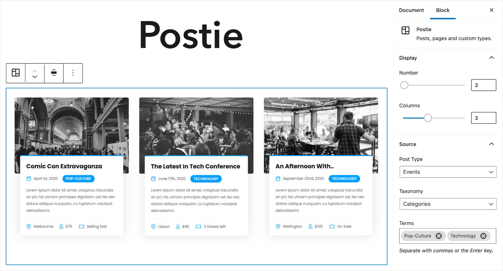

# Postie

A WordPress block for fetching posts, pages and custom post types. 



This plugin just adds the admin UI (i.e renderless block) for creating and managing post blocks, the actual display is up to you. 

## Features
- Fetch any posts, pages and custom post types.
- Filter by any taxonomies, terms and custom fields.
- Choose specific pages, or show all subpages for said pages.
- Order by ID, date, modified date, title, slug, menu order, random or custom field.

With postie you can fetch; fantasy books that are less than $20 sorted by price, or properties that feature waterfront views, have 3 or more bedroom and are sorted by land size.

## Why
Deferring the display of content means you have complete control over markup, styles and functionality so you can craft the display to suit your needs. For example; if you're showing latest properties you may need to display data like `price`, `location` and `features`, or if you're displaying events you may want to show `venue`, `time`, and `tickets`.

## How
Just provide the desired HTML and style the output as you would any other part of your theme. This way you'll always have the cleanest markup and CSS for your needs.

```php
<?php

/**
 * Action to generate the blocks html.
 */
add_action('postie/html', function(WP_Query $query, array $attrs) {
    // Here you actually generate the html from the resulting query.
    // No need to return it, just include your template or echo your content.
}, 10, 2);

/**
 * Filter to optionally modify the main query arguments.
 */
add_filter('postie/query', function(array $args) {
    return array_merge($args, ['author_name' => 'admin']);
});

```

### Notes
Postie requires `PHP 7.4+`.
